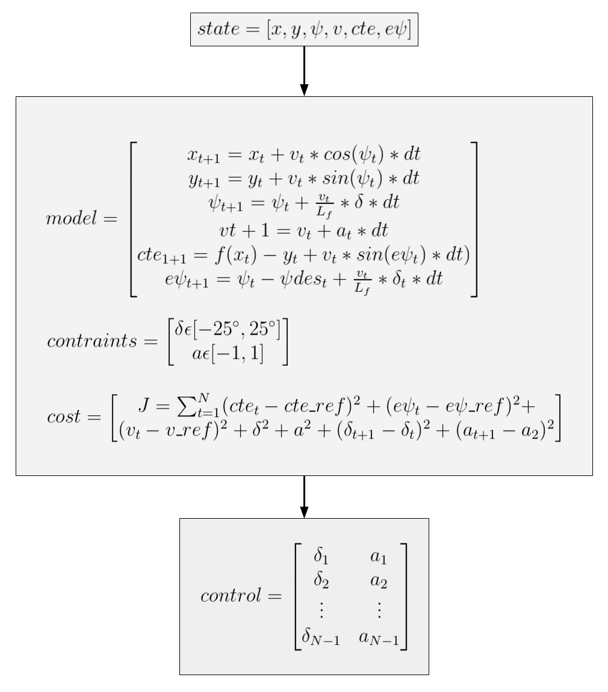

# CarND-Controls-MPC
Self-Driving Car Engineer Nanodegree Program

---
## Introduction

In this project we implement Model Predictive Control to drive the car around the track. This time however we are not given the cross track error, we have to calculate that! Additionally, there's a 100 millisecond latency between actuations commands on top of the connection latency.

## Implementation

### The Model Predictive Control Loop

I implemented the Model Predictive Controller from the Udacity class lectures.  Put simply, this controls the vehicle by optimizing a cost function using a polynomial trajectory to generate actuator outputs.

The main MPC loop and the equations used in this implementation are shown as follows:



The state includes the {x,y} position and velocity of the car with crosstrack and steering angle errors. The constraints are a steering angle between ```-25 and 25``` degrees with a bounded acceleration between ```+1 and -1```.  The cost function minimizes the errors between the desired and current state, the use of the actuator controls, and the amount of change between sequential actions.  The model is based on the kinematic equations for the standard bicycle model with added weight and center of gravity. The control outputs are the steering and acceleration actuations.

### Time Stepping

To generate the ideal trajectory, a set of N points covers a duration of T seconds with a timestep dt.  The duration of the desired trajectory, T, is desired to be around ```1 second```.  Using this as a starting point, I initally set the step size to ```20``` and incremented by a time delta of ```0.05 seconds``` for a total of 1 second.  The issue I had with this was that the solver could not process this faster than about ```33 ms```.  I wanted to keep the solver fast so I could maintain a framerate of ```25``` with some extra headroom.  I decided that ```10 steps``` was ideal for this but I had to increase the dt to ```0.1 seconds``` to meet the one second requirement.  Another reason for having a dt of ```.1 seconds``` was that it lined up perfectly with the ```100 ms``` delay from the measurement system.

### Polynomial Fit

Waypoints from the Unity model are given for the desired track line to follow on the Lake Course.  By fitting a polynomial to the waypoints, it can be sent to the MPC solver to come up with a trajectory that minimizes the error between the car and the track.

The waypoints are provided in world coordinates, so they must be converted to vehicle coordinates before that can be used in MPC.  This is accomplished in main.cpp where the rotation and translation of the vehicle in world space are made available.  Once the coordinates are transformed, a ```3rd order``` polynomial fit is performed and the cross track error and vehicle heading error are calculated.

Since the waypoints are moved into the vehicle coordinate system, the state for the x, y, and psi positions are all set to 0.  This simplifies the state velocity, cross track error, and psi error only.  These are then fed into the MPC ```Solve``` function.

### Latency

In the real world, sensors will have some degree of latency when they get into the model update.  This latency is the sum of delays in the communication path, filters, and even from the sensor itself.  It is important to understand the latency you have in the system so that you can control in the correct timeframe.  Here the latency is hard coded as 100 miliseconds. Since the measurement comes from the past, it is important to either propagate this measurement forward in time or move the control back in time by the delay value.  In my case I moved the control for this measurement back in time one step, where a step is equal to 100 ms. This was handled right in the MPC class ```FG_eval``` function.

## Simulation Results

### The vehicle must successfully drive a lap around the track.

No tire may leave the drivable portion of the track surface. The car may not pop up onto ledges or roll over any surfaces that would otherwise be considered unsafe (if humans were in the vehicle).

Here are the results of running the simulator at a desired setting of ```80 MPH``` completing a full lape of the Lake Course.


A longer 2 minute YouTube video is featured here: https://youtu.be/E5XWZySQaB0

## Dependencies

* cmake >= 3.5
 * All OSes: [click here for installation instructions](https://cmake.org/install/)
* make >= 4.1(mac, linux), 3.81(Windows)
  * Linux: make is installed by default on most Linux distros
  * Mac: [install Xcode command line tools to get make](https://developer.apple.com/xcode/features/)
  * Windows: [Click here for installation instructions](http://gnuwin32.sourceforge.net/packages/make.htm)
* gcc/g++ >= 5.4
  * Linux: gcc / g++ is installed by default on most Linux distros
  * Mac: same deal as make - [install Xcode command line tools]((https://developer.apple.com/xcode/features/)
  * Windows: recommend using [MinGW](http://www.mingw.org/)
* [uWebSockets](https://github.com/uWebSockets/uWebSockets)
  * Run either `install-mac.sh` or `install-ubuntu.sh`.
  * If you install from source, checkout to commit `e94b6e1`, i.e.
    ```
    git clone https://github.com/uWebSockets/uWebSockets
    cd uWebSockets
    git checkout e94b6e1
    ```
    Some function signatures have changed in v0.14.x. See [this PR](https://github.com/udacity/CarND-MPC-Project/pull/3) for more details.

* **Ipopt and CppAD:** Please refer to [this document](https://github.com/udacity/CarND-MPC-Project/blob/master/install_Ipopt_CppAD.md) for installation instructions.
* [Eigen](http://eigen.tuxfamily.org/index.php?title=Main_Page). This is already part of the repo so you shouldn't have to worry about it.
* Simulator. You can download these from the [releases tab](https://github.com/udacity/self-driving-car-sim/releases).
* Not a dependency but read the [DATA.md](./DATA.md) for a description of the data sent back from the simulator.


## Basic Build Instructions

1. Clone this repo.
2. Make a build directory: `mkdir build && cd build`
3. Compile: `cmake .. && make`
4. Run it: `./mpc`.
5. Run it with some speed: `./mpc <speed>`.

## Tips

1. It's recommended to test the MPC on basic examples to see if your implementation behaves as desired. One possible example
is the vehicle starting offset of a straight line (reference). If the MPC implementation is correct, after some number of timesteps
(not too many) it should find and track the reference line.
2. The `lake_track_waypoints.csv` file has the waypoints of the lake track. You could use this to fit polynomials and points and see of how well your model tracks curve. NOTE: This file might be not completely in sync with the simulator so your solution should NOT depend on it.
3. For visualization this C++ [matplotlib wrapper](https://github.com/lava/matplotlib-cpp) could be helpful.)
4.  Tips for setting up your environment are available [here](https://classroom.udacity.com/nanodegrees/nd013/parts/40f38239-66b6-46ec-ae68-03afd8a601c8/modules/0949fca6-b379-42af-a919-ee50aa304e6a/lessons/f758c44c-5e40-4e01-93b5-1a82aa4e044f/concepts/23d376c7-0195-4276-bdf0-e02f1f3c665d)
5. **VM Latency:** Some students have reported differences in behavior using VM's ostensibly a result of latency.  Please let us know if issues arise as a result of a VM environment.

## Editor Settings

* indent using spaces
* set tab width to 2 spaces (keeps the matrices in source code aligned)

## Code Style

This code follows the [Google's C++ style guide](https://google.github.io/styleguide/cppguide.html).

## Project Instructions and Rubric

Note: regardless of the changes you make, your project must be buildable using
cmake and make!

More information is only accessible by people who are already enrolled in Term 2
of CarND. If you are enrolled, see [the project page](https://classroom.udacity.com/nanodegrees/nd013/parts/40f38239-66b6-46ec-ae68-03afd8a601c8/modules/f1820894-8322-4bb3-81aa-b26b3c6dcbaf/lessons/b1ff3be0-c904-438e-aad3-2b5379f0e0c3/concepts/1a2255a0-e23c-44cf-8d41-39b8a3c8264a)
for instructions and the project rubric.

## References

1. https://www.coin-or.org/Ipopt/documentation

2. https://www.coin-or.org/CppAD/Doc/introduction.htm